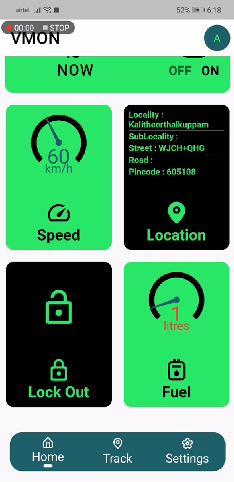
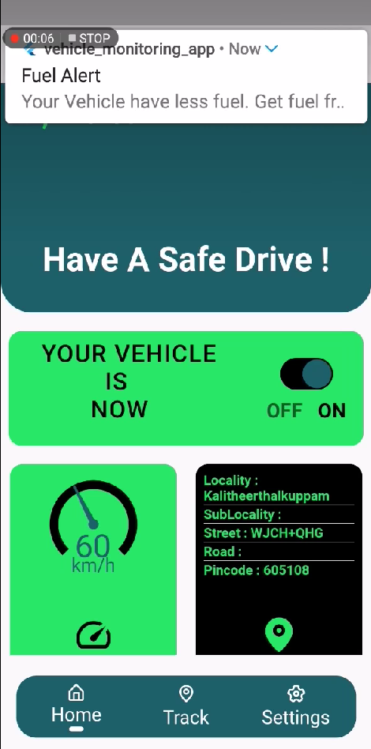

# Realtime Vehicle Monitoring App

## Description
The Realtime Vehicle Monitoring App is designed to interface with an Arduino hardware prototype, providing real-time data to users via Firebase. The app, built with Flutter, offers a comprehensive suite of features including vehicle locking/unlocking, tracking, speed alerts, accident alerts, theft alerts, fuel level monitoring, and location-based services like finding nearby petrol stations.

## Features
- **Vehicle Control**: Lock and unlock your bike remotely.
- **Real-time Tracking**: Track the exact location of your bike on a map.
- **High-Speed Alerts**: Receive alerts when the bike exceeds a set speed limit.
- **Accident Alerts**: Get notified immediately if an accident is detected.
- **Theft Alerts**: Be alerted in case of bike theft.
- **Fuel Level Monitoring**: Check fuel levels in real-time and get notified when fuel is low.
- **Location Services**: View nearby petrol stations on the map.

## Technologies Used
- Flutter
- Dart
- Firebase Realtime Database
- Firebase Authentication
- Google Maps API
- Arduino

## Installation Instructions

1. **Clone the repository**:
   ```sh
   git clone https://github.com/Althaf-codes/realtime-vehicle-monitoring.git
   cd realtime-vehicle-monitoring

2. Install Flutter dependencies:
   ```sh
   flutter pub get

3. Set up Firebase:
   Follow the instructions from Firebase doc to add Firebase to your Flutter app:

4. Run the app:
   ```sh
   flutter run

## Screenshots




## Created Date
This project was created on March 12, 2023.

